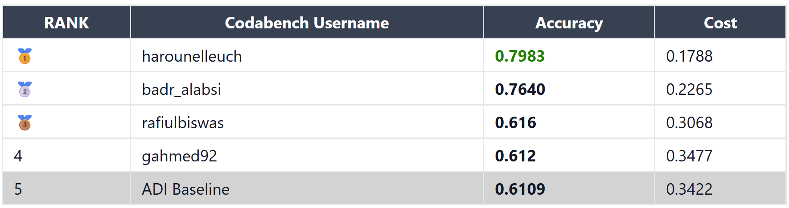

# Arabic Dialect Identification (ADI)

## Overview
This repository contains code and scripts to train Arabic Dialect Identification (ADI) using Whisper and ECAPA-TDNN.

The project involves:
- Processing and preparing the ADI-17 and ADI-20 datasets and their subsets.
- Training and evaluating models for ADI.
- Experiment tracking and result reporting.

Repository structure: 
```
├── dataset             # Guides on how to acquire datasets
├── data_preparation    # Data preparation scripts for reprocucibility
│   └── manifests       # Datset manifests (CSV files)
└── recipes             # Modeling directory: Contains training recipes
    └── hparams         # Hyper-parameters for recipes (YAML files)
```

## Download Trained Models
We share our best model overall: `Whisper-large-v3 Encoder with Attention Pooling (Frozen lower layers + data augmentation)` trained on `ADI-20-53h` on HuggingFace [here](https://huggingface.co/Elyadata/ADI-whisper-ADI20).  
We also make available our best perforing model trained on ADI-17-full on HuggingFace [here](https://huggingface.co/Elyadata/ADI-whisper-ADI17).  

## Installation
### Requirements
Make sure your setup meets the following requirements.
- Python 3.10 environment
- SpeechBrain Intalled in your environment (Preferably in editable mode).
- FFMPEG or SoX (for audio processing)

To install dependencies:
```bash
pip install -r requirements.txt
```

## Dataset Preparation
The project uses the **ADI-17** and **ADI-20** datasets, which consist of Arabic dialect speech segments. Ensure that you replace the placeholder in the manifest CSVs with the location of the datasets you have downloaded.  

Pre-made manifests are available to downoad for your convenience at this [link](https://elyadata-my.sharepoint.com/:f:/p/haroun_elleuch/ErGuqCu8uXBBu0dSQu_WwmsBxwdPWoQyWfHQ67H7xav2uw?e=nk559T). All utterance segmentation is already prepared.

For licencing reasons, we do not share the audio files of the dataset. Instead, you can use the IDs of the YouTube videos to download them yourself. Only the files are needed as the segmentation and labelling of the audios are already done in the CSV manifests.  
Make sure to resample all your files to mono 16khz wav format.

## Running Experiments
### Preprocessing Audio Data
Run the preprocessing script to segment and prepare the audio files:
```bash
python data_preparation/preprocess.py --dataset_path /path/to/data
```

### Training a Model
To train a dialect classifier:
```bash
python recipes/train_<model>.py --config recipes/hparams/<experimpent_name>.yaml
```

### Evaluating a Model
To evaluate on a test set:
```bash
cd model
python train_<model_category>.py --test_only \
    --test_csv=<test_csv> \
    --eval_batch_size=8 \ 
    --fewer_eval_classes=True
```
Note that this will also generate classification reports and confusions matrices. You will find them in the `save_folder` of the model you want to evaluate. These files are also generated at the end of each epoch after validation.

## Experiment Tracking
The repository includes a script to track experiment results (validation scores only) and summarize metrics:
```bash
./results.sh            # Show results in terminal.
./export_results.sh     # Export results to CSV.
```
This generates a table with details on best epochs, F1 scores, and precision-recall metrics.

## NADI 2025
We have also used this model for dialect identification task in the [NADI 2025](https://nadi.dlnlp.ai/2025/) challenge and ranked first:



For more information on how we used the model, you can refer to:
- Our system paper:  [arXiv](https://arxiv.org/abs/2511.10090), [ACL Anthology](https://aclanthology.org/2025.arabicnlp-sharedtasks.105/)
- NADI findings paper:  [arXiv](https://arxiv.org/abs/2509.02038), [ACL Anthology](https://aclanthology.org/2025.arabicnlp-sharedtasks.99/)


## Citations
If using this work, please cite:
```bibtex
@inproceedings{elleuch25_interspeech,
  title     = {{ADI-20: Arabic Dialect Identification dataset and models}},
  author    = {Haroun Elleuch and Salima Mdhaffar and Yannick Estève and Fethi Bougares},
  year      = {2025},
  booktitle = {{Interspeech 2025}},
  pages     = {2775--2779},
  doi       = {10.21437/Interspeech.2025-884},
  issn      = {2958-1796},
}

@inproceedings{elleuch-etal-2025-elyadata,
    title = "{ELYADATA} {\&} {LIA} at {NADI} 2025: {ASR} and {ADI} Subtasks",
    author = "Elleuch, Haroun  and
      Saidi, Youssef  and
      Mdhaffar, Salima  and
      Est{\`e}ve, Yannick  and
      Bougares, Fethi",
    booktitle = "Proceedings of The Third Arabic Natural Language Processing Conference: Shared Tasks",
    month = nov,
    year = "2025",
    address = "Suzhou, China",
    publisher = "Association for Computational Linguistics",
    url = "https://aclanthology.org/2025.arabicnlp-sharedtasks.105/",
    doi = "10.18653/v1/2025.arabicnlp-sharedtasks.105",
    pages = "762--766",
    ISBN = "979-8-89176-356-2",
}
```
